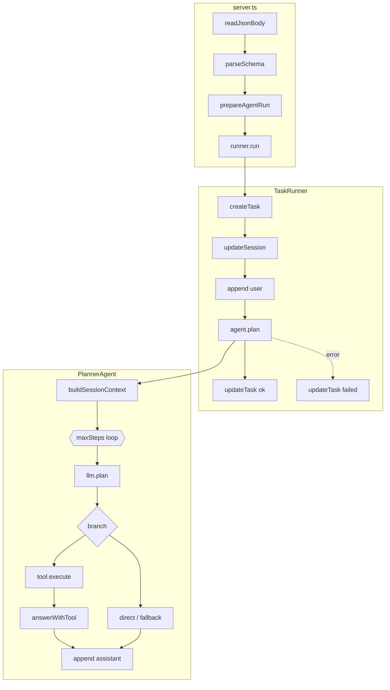

# Agent 完整原理手册

> **定位：** 理解本仓库 Agent 后端的**唯一深读文档**——从 HTTP 进门到落库、Session 记忆、SSE、Eval/Replay、工具安全、五张表，全部串在一起。  
> 巩固周每日任务与命令见 [`docs/consolidation-week.md`](../consolidation-week.md)。  
> 进度状态见 [`docs/current-status.md`](../current-status.md)。

---

## 目录

1. [怎么用这份文档](#怎么用这份文档)
2. [核心思想三句话](#核心思想三句话)
3. [展开总图（实现细节版）](#展开总图实现细节版)
4. [启动与依赖注入](#启动与依赖注入)
5. [HTTP 层完整细节](#http-层完整细节)
6. [TaskRunner.run](#taskrollerrun)
7. [PlannerAgent.plan](#planneragentplan)
8. [Session 上下文（summary + window）](#session-上下文summary--window)
9. [HunyuanLlmClient 三次 LLM](#hunyuanllmclient-三次-llm)
10. [工具层与安全治理](#工具层与安全治理)
11. [Memory 五张表](#memory-五张表)
12. [SSE 流式与 emitStream](#sse-流式与-emitstream)
13. [契约层 api-contract](#契约层-api-contract)
14. [Eval 与 Task Replay](#eval-与-task-replay)
15. [失败路径全景](#失败路径全景)
16. [命名：plannerTrace vs trace](#命名plannertrace-vs-trace)
17. [配置与环境](#配置与环境)
18. [两条完整路径 + 手测命令](#两条完整路径--手测命令)
19. [读代码路线图](#读代码路线图)
20. [巩固周总自检](#巩固周总自检)
21. [常见追问（学习笔记）](#常见追问学习笔记)

---

## 怎么用这份文档

| 你的目标 | 读哪 |
|----------|------|
| 5 分钟建立全局观 | [核心思想](#核心思想三句话) + [展开总图](#展开总图实现细节版) |
| 跟一次请求全链路 | [两条完整路径](#两条完整路径--手测命令) |
| 搞懂长会话记忆 | [Session 上下文](#session-上下文summary--window) |
| 搞懂调试面板三块数据 | [Memory 五张表](#memory-五张表) + [命名](#命名plannertrace-vs-trace) |
| 改 prompt 怎么验证 | [Eval 与 Replay](#eval-与-task-replay) |
| 工具为什么被拦 | [工具层与安全](#工具层与安全治理) |
| 搞懂「记忆追问」与「要不要工具」 | [常见追问](#常见追问学习笔记) §Q1–Q3 |

---

## 核心思想三句话

1. **HTTP 只负责进门和出门** — 读 body、Zod 校验、分配 id、调 `runner.run`、写 JSON/SSE；不碰 LLM。
2. **TaskRunner 是任务状态机外壳** — `tasks` 从 running → succeeded/failed；不管「要不要工具」。
3. **PlannerAgent 是 Agent 大脑** — 循环里 `llm.plan`（function calling）→ 可选 `tool.execute` → `llm.answerWithTool`；落库 `planner_steps` + `tool_calls`。

```text
runner.run  = DB 任务生命周期 + 调 plan
agent.plan  = Agent 思考循环（0→J）
llm.plan    = 每轮「要不要工具」（不执行工具）
```

### 四层分工

| 层 | 文件 | 只管 | 不管 |
|----|------|------|------|
| HTTP | `server.ts` | 路由、契约、id、响应 | LLM、工具 |
| 任务外壳 | `task-runner.ts` | tasks/messages 状态机 | 工具选择 |
| Agent 大脑 | `planner-agent.ts` | plan 循环、工具、落库 | HTTP、混元 wire 协议 |
| LLM 适配 | `hunyuan-llm-client.ts` | prompt、function calling、stream | 落库、工具安全 |
| 工具 | `tools/*` | execute + **安全 enforce** | 规划决策 |
| 持久化 | `postgres-memory-store.ts` | 五表 SQL | 业务规则 |

---

## 展开总图（实现细节版）

```text
curl POST /agent/run 或 /agent/stream
  │  body 在 HTTP 流里，不在 req 上 → readJsonBody → JSON.parse
  │
  ▼
┌─ server.ts ─────────────────────────────────────────────────────┐
│  readJsonBody(req)           → body = { input, sessionId? }     │
│  parseSchema(Zod)            → 失败 400 + error.details         │
│  prepareAgentRun             → sessionId（无则 createSession）   │
│                              → taskId（UUID，本轮任务主键）       │
│  runner.run({ taskId, sessionId, input })                       │
│    /agent/stream 额外传 emitStream → 写 SSE 帧（DB 路径相同）    │
└───────────────────────────────┬─────────────────────────────────┘
                                  │
                                  ▼
┌─ TaskRunner.run（task-runner.ts）───────────────────────────────┐
│  ① createTask(running)          → tasks                         │
│  ② updateSession(lastTaskAt)    → sessions                      │
│  ③ append(user)                 → messages                      │
│  ④ agent.plan(context)          → ★ 见 PlannerAgent             │
│  ⑤ updateTask(succeeded)        → tasks.summary                 │
│  ⑥ catch → updateTask(failed)   → tasks.errorCode/Message       │
└───────────────────────────────┬─────────────────────────────────┘
                                  │
                                  ▼
┌─ PlannerAgent.plan（planner-agent.ts）─────────────────────────┐
│  0 buildSessionContext → 可能 summarizeSession（第 0 次 LLM）   │
│  for step 1..maxSteps:                                          │
│    A llm.plan() → PlannerDecision                               │
│    B direct_answer | C budget_exceeded | E duplicate_skipped    │
│    F tool_executed | G tool_failed                              │
│    H fallback_answer（循环用尽）                                  │
│  I emitTokenStream（SSE 兜底）                                   │
│  J append(assistant) → return { summary, toolCalls }            │
└───────────────────────────────┬─────────────────────────────────┘
                                  │
                                  ▼
┌─ HunyuanLlmClient ──────────────────────────────────────────────┐
│  summarizeSession | plan (function calling) | answerWithTool      │
└───────────────────────────────┬─────────────────────────────────┘
                                  │
                                  ▼
┌─ 落库与观测 ────────────────────────────────────────────────────┐
│  sessions | tasks | messages | planner_steps | tool_calls         │
│  GET /tasks/:id  +  SSE（仅进行中，不落库）                        │
└─────────────────────────────────────────────────────────────────┘
```

### Mermaid 架构图



---

## 启动与依赖注入

文件：`apps/api/src/app/create-agent-runtime.ts`

`main()` 启动时**只组装一次**，HTTP 与 `evals:run` 共用同一套实例：

```text
loadConfig()
  → createPgPool → PostgresMemoryStore(memory)
  → HunyuanLlmClient(llm)
  → tools[] = TimeTool, HttpFetchTool, EchoTool, ReadFileTool
  → PlannerAgent(agent)  // maxSteps, toolCallBudget, sessionHistory*
  → TaskRunner({ agent, tools, memory, llm, logger })
```

**思路：** 业务代码不 `new` 混元客户端；换模型/换库只改这一处。

---

## HTTP 层完整细节

文件：`apps/api/src/server.ts`

### 四类路由

| 类型 | 路径 | 作用 |
|------|------|------|
| Agent 执行 | `POST /agent/run` | 同步 JSON |
| Agent 执行 | `POST /agent/stream` | SSE 流式 |
| Session | `GET /sessions`、`GET .../messages`、`PATCH .../archive` | 列表/历史/归档 |
| Task 观测 | `GET /tasks/:id` | task + messages + toolCalls + plannerTrace |
| 健康 | `GET /health` | 探活 |

### `readJsonBody`：body 不在 `req` 上

文件：`apps/api/src/http/http-request.ts`

```text
for await (chunk of req) → Buffer.concat → JSON.parse
```

`curl -d '{"input":"..."}'` 的内容在 **HTTP body 流**里；`console.log(req)` 看不到 `input`。详见 [http-request-body.md](./http-request-body.md)。

### `parseSchema`：契约校验

- Schema：`packages/api-contract` → `RunAgentRequestSchema`（`.strict()`，未知字段进 `error.details`）
- 失败：`400 BAD_REQUEST` + `details: ["input: ..."]`
- 详见 [request-validation-errors.md](./request-validation-errors.md)

### `prepareAgentRun`

文件：`apps/api/src/http/prepare-agent-run.ts`

| 输入 | 行为 |
|------|------|
| 无 `sessionId` | `randomUUID()` + `createSession` |
| 有 `sessionId` 但 DB 无行 | `createSession` 占位 |
| `taskId` | 客户端可传；默认 `randomUUID()` |

**sessionId vs taskId：**

| id | 含义 | 生命周期 |
|----|------|----------|
| `sessionId` | 对话容器 | 多轮 run 复用 |
| `taskId` | 单次 Agent run | 每次 POST 一个新 task |

### 错误怎么回 HTTP

`catch` → `classifyError` → `buildErrorPayload` → `writeJson(status, { error })`

| code | HTTP | 典型来源 |
|------|------|----------|
| `BAD_REQUEST` | 400 | Zod、工具参数、JSON 语法 |
| `NOT_FOUND` | 404 | session/task 不存在 |
| `LLM_ERROR` | 500 | 混元 API 失败 |
| `TOOL_ERROR` | 500 | 工具执行失败 |

校验失败在 **TaskRunner 之前**；Agent 失败在 TaskRunner catch 里写 `tasks.failed` 再抛出。

---

## TaskRunner.run

文件：`apps/api/src/runtime/task-runner.ts`

| 步 | 动作 | 表 | 思路 |
|----|------|-----|------|
| ① | `createTask(running)` | `tasks` | 立刻可观测 |
| ② | `updateSession(lastTaskAt)` | `sessions` | 列表排序 |
| ③ | `append(user, input)` | `messages` | 本轮用户话；Planner 读历史用 |
| ④ | `agent.plan(request, context)` | 多表 | **核心** |
| ⑤ | `updateTask(succeeded, summary)` | `tasks` | |
| ⑥ | catch → `updateTask(failed)` | `tasks` | 再 throw |

**注入给 plan 的 context：**

```ts
{ tools, memory, llm, logger, emitStream? }
```

**不做：** 不调混元、不选工具、不写 `planner_steps`。

---

## PlannerAgent.plan

文件：`apps/api/src/agents/planner-agent.ts`

### 阶段 0：buildSessionContext

见 [Session 上下文](#session-上下文summary--window)。

### 阶段 A–J：主循环

配置：`AGENT_MAX_STEPS`（默认 3）、`AGENT_TOOL_CALL_BUDGET`（默认 2）。

| 阶段 | 条件 | outcome | finalAnswer 来源 | 后事 |
|------|------|---------|------------------|------|
| **A** | 每轮开头 | — | — | `llm.plan()` + SSE `planner_decision` |
| **B** | 不需要工具 | `direct_answer` | draftAnswer 或 answerWithTool | break |
| **C** | 预算用尽仍要工具 | `budget_exceeded` | answerWithTool(上次结果) | break |
| **E** | 同名同参重复 | `duplicate_skipped` | answerWithTool(已有) | break |
| **F** | 正常执行工具 | `tool_executed` | tool → answerWithTool | break |
| **G** | 工具抛错 | `tool_failed` | — | throw → TaskRunner failed |
| **H** | 循环结束无回答 | `fallback_answer` | answerWithTool | — |
| **I** | stream 且未推 token | — | emitTokenStream 切片 | — |
| **J** | 收尾 | — | append assistant | return |

**关键设计：** 工具成功后 **break**，不再第二轮 `llm.plan`（eval 基线 `maxToolCalls=1`）。

### outcome 全表

| outcome | 含义 |
|---------|------|
| `direct_answer` | LLM 决定直接答 |
| `tool_executed` | 工具跑成功 |
| `tool_failed` | 工具抛错 |
| `budget_exceeded` | 工具次数到顶 |
| `duplicate_skipped` | 重复工具调用被跳过 |
| `fallback_answer` | maxSteps 用尽兜底 |

---

## Session 上下文（summary + window）

文件：`planner-agent.ts` → `buildSessionContext`  
设计文档：[`docs/session-context.md`](../session-context.md)

### 为什么需要

长会话不能把所有 `messages` 塞进 prompt。策略：**旧消息压 summary，最近 N 条保留原文**。

### 算法（有 sessionId 时）

```text
1. getSession + listAllSessionMessages(sessionId)
2. toLlmConversationMessages：
     排除当前 taskId 的消息（避免本轮 user 重复）
     只保留 user / assistant / tool（不要 system）
3. recentHistory = 最后 N 条（SESSION_HISTORY_MESSAGE_LIMIT）
     再 applyCharBudget（SESSION_HISTORY_CHAR_BUDGET，从后往前截）
4. olderMessages = 剩余更早消息
5. 若 older 为空 → sessionSummary=null，直接返回 recent
6. 若 sessions.summary 已覆盖全部 older（summaryMessageCount 对齐）
     → 复用 summary，不调 LLM
7. 否则 llm.summarizeSession（增量：只总结尚未覆盖的 older）
     → updateSession(summary, summaryMessageCount, summaryUpdatedAt)
8. plan / answerWithTool 时注入：
     sessionSummary + recentHistory + userInput
```

### 两个 env

| 变量 | 默认 | 作用 |
|------|------|------|
| `SESSION_HISTORY_MESSAGE_LIMIT` | 8 | recent window 最多几条 |
| `SESSION_HISTORY_CHAR_BUDGET` | 4000 | recent 总字符上限 |

### 手测记忆

```bash
# 第一轮
curl -s -X POST http://localhost:3000/agent/run \
  -H 'content-type: application/json' \
  -d '{"input":"请记住：我喜欢东京。只回复收到。"}' | tee /tmp/s.json | jq .

export SESSION_ID=$(jq -r .sessionId /tmp/s.json)

# 第二轮同 session
curl -s -X POST http://localhost:3000/agent/run \
  -H 'content-type: application/json' \
  -d "{\"input\":\"我刚才说我喜欢哪里？\",\"sessionId\":\"$SESSION_ID\"}" | jq .result.summary

curl -s http://localhost:3000/sessions/$SESSION_ID | jq '.session | {summary, summaryMessageCount}'
```

**LLM 调用：** 长会话首次需摘要时 +1 次 `summarizeSession`（在 `llm.plan` 之前）。

---

## HunyuanLlmClient 三次 LLM

文件：`apps/api/src/llm/hunyuan-llm-client.ts`  
接口：`apps/api/src/llm/llm-client.ts`

### 调用次序（典型）

| 次序 | 方法 | 何时 | 次数 |
|------|------|------|------|
| 第 0 | `summarizeSession` | 长会话需更新 summary | 0 或 1 |
| 第 1 | `plan` | 每轮 step 的 A 阶段 | 1（工具成功后 break，通常不再第 2 轮 plan） |
| 第 2 | `answerWithTool` | 工具路径或需组织人话 | 0 或 1 |

### `plan`（function calling）

| 步 | 内容 |
|----|------|
| 1 | system：何时 time / http_fetch / read_file |
| 2 | user = `buildPlannerInput`（摘要+历史+input+工具列表+本轮已执行工具） |
| 3 | tools schema：统一 `{ input: string }`，`tool_choice: auto` |
| 4a | 有 `tool_calls` → `needsTool=true`, toolName, toolInput |
| 4b | 无 → `needsTool=false`, draftAnswer=正文 |

### `answerWithTool`

- 输入：会话历史 + userInput + toolName/Input/Output
- `onToken` 回调 → SSE `token`（`/agent/stream`）
- `/agent/run` 也走同一方法，只是无 `onToken`

### `summarizeSession`

- 合并 `existingSummary` + 待摘要 messages
- 输出写 `sessions.summary`

### TokenHub 配置（三者配套）

```bash
HUNYUAN_MODEL=hy3-preview
HUNYUAN_BASE_URL=https://tokenhub.tencentmaas.com/v1
HUNYUAN_API_KEY=<TokenHub 控制台 Key>
```

旧 `api.hunyuan.cloud.tencent.com` 的 Key **不能**用于 TokenHub。

---

## 工具层与安全治理

注册位置：`create-agent-runtime.ts`  
Planner 通过 `llm.plan` 的 function name 选用；**安全在 Tool.execute 内 enforce**，不依赖模型「自觉」。

| 工具 | name | 作用 | 安全要点 |
|------|------|------|----------|
| TimeTool | `time` | 当前时间 | 无外部 IO |
| HttpFetchTool | `http_fetch` | 抓网页文本 | denyHosts（localhost/127.0.0.1）、内网 IP 拦截、Content-Type 白名单、响应大小上限 |
| EchoTool | `echo` | 回显 | 调试用 |
| ReadFileTool | `read_file` | 读沙箱内文件 | `READ_FILE_ROOT_DIR` 根目录、`resolveSafePath` 防 `../`、扩展名白名单、拒绝 `.env` 等 |

### 两层安全模型

```text
LLM 行为层：prompt 引导「不要抓内网」→ 模型可能口头拒绝而不调工具
Tool  enforce 层：即使模型调了，validateUrl / resolveSafePath 仍抛 BAD_REQUEST
```

eval 中 `blocked-read-*` case 可能出现 **task succeeded 但模型未调工具** — 这是 LLM 行为 vs Tool enforce 的差异，巩固周观察即可。

### 工具执行在 plan 中的位置（F 阶段）

```text
emitStream(tool_start)
  → tool.execute({ input: toolInput })
  → memory.append(role=tool)
  → recordToolCall(succeeded)
  → emitStream(tool_end)
  → recordPlannerStep(tool_executed)
  → answerFromToolResult → llm.answerWithTool
```

---

## Memory 五张表

接口：`apps/api/src/memory/memory-store.ts`  
实现：`apps/api/src/memory/postgres-memory-store.ts`  
类型：`apps/api/src/memory/persistence-model.ts`

| 表 | API 字段 | 写什么 | 谁写 | 读什么 |
|----|----------|--------|------|--------|
| `sessions` | `GET /sessions` | title, status, **summary**, summaryMessageCount, lastTaskAt | prepareAgentRun, TaskRunner, buildSessionContext | 列表、上下文 |
| `tasks` | `GET /tasks` → `task` | input, **status**, summary, errorCode, errorMessage | TaskRunner | 状态、错误 |
| `messages` | `.../messages` 或 task 内 | user / assistant / **tool** 文本 | TaskRunner(user), Planner(assistant/tool) | 对话时间线 |
| `tool_calls` | `toolCalls` | 工具 input/output、status | Planner 工具分支 | **实际执行** |
| `planner_steps` | `plannerTrace` | needsTool, outcome, toolName | Planner `recordStep` | **规划决策** |

### 三个概念别混

| 问题 | 看哪 |
|------|------|
| 模型**想**干什么？ | `plannerTrace` / `planner_steps` |
| 工具**真**跑了什么？ | `toolCalls` / `tool_calls` |
| 对话里**说了**什么？ | `messages` |

**禁止**把 Agent 决策链叫 `trace`（易与 OpenTelemetry `traceId` 混淆）。见 `docs/current-status.md` 【H 节】。

### MemoryStore 核心方法

| 方法 | 用途 |
|------|------|
| `createSession` / `updateSession` / `getSession` | session 生命周期 + summary |
| `createTask` / `updateTask` / `getTask` | task 状态机 |
| `append` / `list` / `listAllSessionMessages` | messages |
| `recordToolCall` / `listTaskToolCalls` | 工具执行 |
| `recordPlannerStep` / `listTaskPlannerSteps` | 规划决策 |

---

## SSE 流式与 emitStream

- **仅** `POST /agent/stream` 注入 `emitStream`；`/agent/run` 不传。
- TaskRunner **透传**给 Planner；Planner 在关键点 `emitStream?.(event)`。
- 契约：`packages/api-contract/src/stream-events.ts`

| 事件 type | 何时 | 落库？ |
|-----------|------|--------|
| `planner_decision` | `llm.plan` 后 | 否（决策在 planner_steps） |
| `tool_start` / `tool_end` | 工具前后 | 否（执行在 tool_calls） |
| `token` | answerWithTool 或 emitTokenStream | 否 |
| `done` | run 成功结束 | 否（结果在 tasks/messages） |
| `error` | run 失败 | 否 |

**过程看 SSE，审计看 DB。** 刷新页面后看 `GET /tasks/:id`。

### 典型 SSE 顺序（要工具）

```text
planner_decision (needsTool: true, toolName: time)
tool_start
tool_end (succeeded)
token × N
done
```

---

## 契约层 api-contract

包：`packages/api-contract`

| 职责 | 内容 |
|------|------|
| Zod schema | 请求/响应/SSE 事件 |
| TS 类型 | 前后端共享 |
| 后端校验 | `parseSchema` in `server.ts` |
| 前端校验 | fetch 后可 `.parse()` |

核心 schema：`RunAgentRequestSchema`、`RunAgentResponseSchema`、`GetTaskResponseSchema`、`AgentStreamEventSchema`、`ErrorResponseSchema`（含可选 `details`）。

**改字段顺序：** schema → server → 前端 → 文档 `http-api.md`。

---

## Eval 与 Task Replay

### Eval 是什么

**端到端回归**：真实 TaskRunner + 真实 LLM + 真实 DB，不是 mock。

| 组件 | 路径 |
|------|------|
| 用例 | `apps/api/evals/cases/basic-agent-cases.json` |
| 运行 | `pnpm run evals:run` |
| 脚本 | `apps/api/src/scripts/run-evals.ts` |
| 报告 | `apps/api/evals/reports/eval-run-*.json` |

### 断言维度

| 字段 | 测什么 |
|------|--------|
| `expectedTools` | 必须调用的工具 |
| `forbiddenTools` | 不能出现的工具 |
| `expectedKeywords` | 回答含关键词 |
| `maxToolCalls` | 工具次数上限 |
| `expectedTaskStatus` + `expectedErrorCode` | 预期失败 |

用例格式：`input`（单轮）或 `steps`（同 session 多轮）**二选一**。

### Replay 是什么

```bash
pnpm run task:replay -- <taskId>
```

从 DB 还原：`task` + `messages` + `toolCalls` + `plannerTrace`（与 `GET /tasks/:id` 同结构）。

**排查顺序：** eval 报告 failures → 拿 taskId → replay → 看 `plannerTrace.outcome` 与 `toolCalls`。

### 故意改坏实验（巩固周 Day 4）

1. 删 `hunyuan-llm-client.ts` plan prompt 里 time 相关一句
2. `pnpm run evals:run` → `time-query` 应 fail
3. replay 看 `direct_answer` 而非 `tool_executed`
4. 改回 prompt → eval 恢复

---

## 失败路径全景

| 阶段 | 现象 | tasks 状态 | HTTP |
|------|------|------------|------|
| JSON 语法错 | readJsonBody | 未创建 | 400 |
| Zod 校验失败 | parseSchema | 未创建 | 400 + details |
| LLM API 失败 | plan/answer 抛 LLM_ERROR | failed | 500 |
| 工具安全拦截 | tool 抛 BAD_REQUEST | failed | 500 |
| 未注册工具名 | TOOL_ERROR | failed | 500 |
| 任务不存在 | GET /tasks | — | 404 |

TaskRunner：**先** `updateTask(failed)` **再** throw，所以失败任务仍可在 DB 查到 errorCode。

---

## 命名：plannerTrace vs trace

| 概念 | 正确命名 | 错误命名 |
|------|----------|----------|
| Planner 每轮决策 | `plannerTrace` / `planner_steps` | `trace` |
| 工具执行 | `toolCalls` / `tool_calls` | — |
| 分布式链路（未来） | `traceId` / `spanId` | 勿占用 `plannerTrace` |

---

## 配置与环境

### Agent 行为

| 变量 | 默认 | 影响 |
|------|------|------|
| `AGENT_MAX_STEPS` | 3 | plan 循环上限 |
| `AGENT_TOOL_CALL_BUDGET` | 2 | 单任务工具次数 |
| `SESSION_HISTORY_MESSAGE_LIMIT` | 8 | recent window 条数 |
| `SESSION_HISTORY_CHAR_BUDGET` | 4000 | recent 字符预算 |

### 工具安全（节选）

| 变量 | 作用 |
|------|------|
| `HTTP_FETCH_DENY_HOSTS` | 默认含 localhost, 127.0.0.1 |
| `READ_FILE_ROOT_DIR` | 默认 `evals/fixtures` |
| `READ_FILE_DENIED_BASENAMES` | 默认 `.env,.env.local` |

完整列表：`apps/api/.env.example`、`apps/api/src/config/env.ts`。

### 日常启动

```bash
docker compose -f apps/api/infra/postgres/compose.yaml up -d
pnpm run db:migrate && pnpm run db:check
pnpm run dev:server    # 或 F5 API: Debug HTTP Server
curl -s http://localhost:3000/health | jq .
```

---

## 两条完整路径 + 手测命令

### 路径 1：无工具

```text
prepare → runner.run → plan → llm.plan(needsTool=false)
  → direct_answer → append assistant → succeeded
LLM: 1 次
```

### 路径 2：要工具

```text
prepare → runner.run → plan → llm.plan(needsTool=true, time)
  → TimeTool.execute → tool_executed → answerWithTool → succeeded
LLM: 2 次
```

### 命令合集

```bash
# 健康
curl -s http://localhost:3000/health | jq .

# 无工具
curl -s -X POST http://localhost:3000/agent/run \
  -H 'content-type: application/json' \
  -d '{"input":"用一句话介绍你自己"}' | tee /tmp/r.json | jq .

# 有工具
curl -s -X POST http://localhost:3000/agent/run \
  -H 'content-type: application/json' \
  -d '{"input":"现在几点"}' | tee /tmp/r.json | jq .

# 观测
TASK_ID=$(jq -r .taskId /tmp/r.json)
curl -s http://localhost:3000/tasks/$TASK_ID | jq '{
  status: .task.status,
  plannerTrace: [.plannerTrace[] | {step, outcome, toolName}],
  toolCalls: [.toolCalls[] | {toolName, status}],
  messages: [.messages[] | .role]
}'

# SSE
curl -N -X POST http://localhost:3000/agent/stream \
  -H 'content-type: application/json' \
  -d '{"input":"请调用 time 工具告诉我现在时间"}'

# Eval + Replay
pnpm run evals:run
pnpm run task:replay -- <taskId>

# DB
pnpm run db:inspect
```

---

## 读代码路线图

### 按天（巩固周）

| 天 | 重点文件 |
|----|----------|
| Day 1 | `server.ts`, `prepare-agent-run.ts`, `task-runner.ts` |
| Day 2 | `planner-agent.ts`, `hunyuan-llm-client.ts`, `agent-stream.ts`, `stream-events.ts` |
| Day 3 | `buildSessionContext`, `session-context.md` |
| Day 4 | `run-evals.ts`, `basic-agent-cases.json`, `replay-task.ts` |
| Day 5 | `memory-store.ts`, `postgres-memory-store.ts`, `http-fetch-tool.ts`, `read-file-tool.ts` |

### 按链路（推荐）

```text
server.ts L48-54
  → prepare-agent-run.ts
  → task-runner.ts run()
  → planner-agent.ts plan() + buildSessionContext
  → hunyuan-llm-client.ts
  → tools/*
  → postgres-memory-store.ts
  → create-agent-runtime.ts（依赖全貌）
```

---

## 巩固周总自检

理解本文 + 完成手测，可逐项打勾：

- [ ] 能**不看代码**画出四层分工 + TaskRunner 六步 + Planner A–J
- [ ] 能解释 `sessionId` vs `taskId`；body 为何不在 `req` 上
- [ ] 能解释 `plannerTrace` vs `toolCalls` vs `messages`
- [ ] 能说出三次 LLM 各自何时调用、典型几次
- [ ] 能解释 summary + recent window 与 `summaryMessageCount`
- [ ] 用手动 curl 复现同 session 追问
- [ ] 跑过 `pnpm run evals:run`，读过 fail 的 `taskId`
- [ ] 会用 `pnpm run task:replay -- <taskId>`
- [ ] 知道工具安全在 Tool 层 enforce（http_fetch / read_file）
- [ ] 知道 `/agent/run` 与 `/agent/stream` 落库相同、SSE 仅展示
- [ ] F5 调试能看到 `HTTP server started`
- [ ] TokenHub 三变量配套

**全部打勾 ≈ E.5 巩固周完成。**

---

## 常见追问（学习笔记）

> 巩固周学习过程中的追问与澄清，避免常见误解。

### Q1：先告诉 Agent 我叫什么、偏好什么，聊几轮后再问「我叫什么」，直接回答是怎么做到的？

**不是模型权重里「记住」了你**，而是每轮 run 前从 DB 读出同 session 历史，塞进 `llm.plan` 的 prompt。

```text
第 1 轮  POST { input: "我叫小明，喜欢东京" }           → messages 落库
第 2–N 轮 POST { ..., sessionId }                      → messages 继续堆
追问轮  POST { input: "我叫什么？", sessionId }
  → buildSessionContext()
       listAllSessionMessages(sessionId)
       排除当前 taskId（避免和本轮 input 重复）
       recentHistory：最近 N 条原文
       older → sessions.summary（必要时 summarizeSession）
  → llm.plan({ sessionSummary, conversationHistory, userInput: "我叫什么？" })
  → 上下文里已有「小明」→ needsTool=false
  → direct_answer，draftAnswer ≈「你叫小明」
```

| 存哪 | 字段 / 表 |
|------|-----------|
| 每轮对话原文 | `messages`（user / assistant） |
| 更早历史压缩 | `sessions.summary` |
| 单次 run | `tasks`（每次 POST 新 taskId） |
| 多轮容器 | `sessions`（同一 sessionId） |

验证：`plannerTrace[].outcome === "direct_answer"`，`toolCalls` 为空。

```bash
curl -s -X POST http://localhost:3000/agent/run \
  -H 'content-type: application/json' \
  -d '{"input":"我叫小明，喜欢东京。只回复收到。"}' | tee /tmp/s.json | jq -r .sessionId

# 记下 sessionId 后追问
curl -s -X POST http://localhost:3000/agent/run \
  -H 'content-type: application/json' \
  -d '{"input":"我叫什么？","sessionId":"<SESSION_ID>"}' | jq .
```

---

### Q2：本质是不是把总结的上下文丢给 Agent，让 Agent 决策？它怎么知道调工具还是直接答？

**前半句对**：记忆 = **每轮注入上下文**（summary + recent + 本轮 input），不是持久化在模型里。

**「谁决策」要更精确**：

- **要不要工具**：`llm.plan()` 这一次 **function calling** 的返回结果
- **怎么执行**：`PlannerAgent` 按 `needsTool` 走 B（直接答）或 F（调工具）等分支

```text
buildSessionContext（拼记忆，与工具决策无关）
        ↓
llm.plan()  ← ★ 决策点：有 tool_calls 还是要工具，没有就 direct_answer
        ↓
PlannerAgent 只负责执行：
  needsTool=false → B: direct_answer
  needsTool=true  → F: tool.execute → answerWithTool
```

模型依据三类信息一次判断：

| 输入 | 来源 | 作用 |
|------|------|------|
| System prompt | `hunyuan-llm-client.ts` | 规则：问时间→time，读 URL→http_fetch… |
| tools 列表 | `create-agent-runtime` 注册 | function schema，`tool_choice: auto` |
| 上下文 | `buildPlannerInput` | summary + 历史 + input + 本轮已执行工具结果 |

示例：

- 「我叫什么」→ 上下文里已有名字 → **无 tool_calls** → `direct_answer`
- 「现在几点」→ 需要实时信息 → **tool_calls: time** → `tool_executed`

后端**没有** `if (input.includes("几点"))` 这类关键词匹配；eval 测的是端到端 LLM 行为。

---

### Q3：是不是对工具做循环，没匹配到工具就算直接回答？

**不是。** 不是 `for each tool { try match }`，而是 **LLM 一次二选一**：

```text
llm.plan() 一次调用
  ├─ 回复含 tool_calls[0]  → needsTool=true  → 执行模型点名的那一个工具
  └─ 回复只有正文          → needsTool=false → direct_answer
```

`for step in 1..maxSteps` 是 Planner **外层循环**（可多轮 plan），不是遍历工具列表：

| 场景 | 通常几轮 step |
|------|----------------|
| 直接答 / 单次工具后回答 | 1 轮后 break |
| 超工具预算、异常路径 | 可能 2+ 轮或 `budget_exceeded` |

**易错对照：**

| ❌ 误解 | ✅ 实际 |
|---------|---------|
| 挨个试工具，都不匹配就直答 | 模型一次决定：调某一个工具，或不调 |
| direct_answer = 工具匹配失败 | direct_answer = `plan()` **没有返回** `tool_calls` |
| Agent 自己记名字 | 名字在 **messages / sessions.summary**，每轮读入 prompt |

```text
                    buildSessionContext（记忆）
                              ↓
用户 input ──→  llm.plan()（规则 + 工具列表 + 上下文）
                    │
         ┌──────────┴──────────┐
         ▼                     ▼
   无 tool_calls           有 tool_calls
   direct_answer           tool.execute → answerWithTool
```

断点验证：`hunyuan-llm-client.ts` → `plan()` → 看 `completion.choices[0].message.tool_calls` 有无值。

---

## 相关文档

| 文档 | 用途 |
|------|------|
| [agent-run-chain.md](./agent-run-chain.md) | 简明速查 |
| [http-request-body.md](./http-request-body.md) | body 读流 |
| [request-validation-errors.md](./request-validation-errors.md) | 400 details |
| [debug-http-server.md](./debug-http-server.md) | F5 调试 |
| [consolidation-week.md](../consolidation-week.md) | 每日任务 |
| [session-context.md](../session-context.md) | 上下文策略 |
| [evals-and-replay.md](../evals-and-replay.md) | eval 格式 |
| [http-api.md](../http-api.md) | API 参考 |
