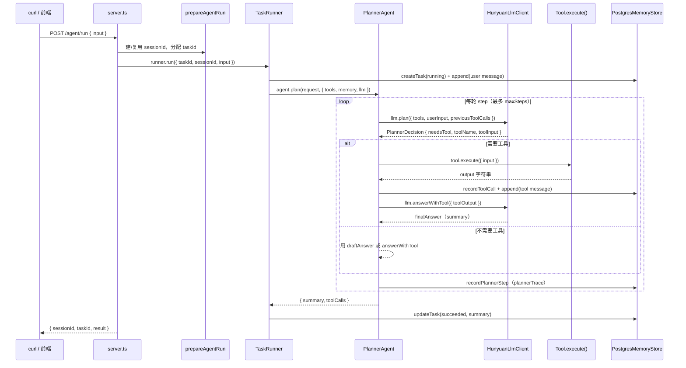

# Tool 运行与调用链路

> **核心结论：** LLM 在 `plan()` 里**选型**（function calling），`PlannerAgent` 在 `tool.execute()` 里**执行**，`answerWithTool()` **组织最终回答**。Tool 不是 LLM 直接跑的。  
> **配套代码：** `apps/api/src/tools/tool.ts`、`create-agent-runtime.ts`、`task-runner.ts`、`planner-agent.ts`、`hunyuan-llm-client.ts`  
> **相关速查：** [`agent-run-chain.md`](./agent-run-chain.md)（`runner.run` → `plan` 总图）；[`agent-core-flow.md`](./agent-core-flow.md)（完整原理手册）

---

## 一、总链路（一张图背下来）



### ASCII 缩略图（终端里也能看）

```text
POST /agent/run { input }
  → prepareAgentRun(sessionId, taskId)
  → TaskRunner.run()
       ① createTask(running) + append(user)
       ② PlannerAgent.plan({ tools, llm, memory })
            for step in 1..maxSteps:
              llm.plan()          ← 第一次 LLM：选型（function calling）
              tool.execute()        ← 运行时真正执行（非 LLM）
              recordToolCall        ← tool_calls 表
              llm.answerWithTool()  ← 第二次 LLM：根据工具结果组织人话
              recordPlannerStep     ← planner_steps 表
       ③ updateTask(succeeded) + return { summary, toolCalls }
  → writeJson({ sessionId, taskId, result })
```

---

## 二、分 6 步看链路

### 1. 启动时：工具注册（依赖注入）

所有 Tool 实例在 `create-agent-runtime.ts` 里组装；**HTTP（`dev:server`）与 eval（`evals:run`）共用同一套**，保证行为一致。

| 依赖 | 实现 | 与 Tool 的关系 |
|------|------|----------------|
| `tools[]` | `TimeTool` / `HttpFetchTool` / `EchoTool` / `ReadFileTool` / `ListDirTool` / `SearchDocsTool` | 注册进数组 |
| `agent` | `PlannerAgent` | 按 `name` 查找并 `execute()` |
| `runner` | `TaskRunner` | 把 `tools` 传给 `agent.plan()` |
| `llm` | `HunyuanLlmClient` | 把 `name` + `description` 发给模型选型 |

文件：`apps/api/src/app/create-agent-runtime.ts`

每个 Tool 只需实现三个字段（`apps/api/src/tools/tool.ts`）：

```typescript
export interface Tool {
  name: string;        // 与 LLM function name 一致
  description: string; // 写入 function schema，帮模型选型
  execute(input: ToolInput): Promise<string>; // Planner 调用，返回纯文本
}
```

**注意：** 新增或修改 Tool 后须**重启** `dev:server`，工具在进程启动时注册，热更新不一定生效。

---

### 2. HTTP 入口：把请求交给 TaskRunner

`server.ts` 里 `/agent/run` 与 `/agent/stream` 共用 `prepareAgentRun`，差别只在是否传 `emitStream`：

| 路由 | 文件位置 | Tool 相关 |
|------|----------|-----------|
| `POST /agent/run` | `server.ts` L48–54 | `runner.run({ taskId, sessionId, input })` |
| `POST /agent/stream` | `server.ts` L58–73 | 同上 + `{ emitStream }` 推 SSE |

`prepareAgentRun`（`http/prepare-agent-run.ts`）只负责：

- 无 `sessionId` → 新建 session
- 分配 `taskId`

**不涉及工具选型或执行。**

---

### 3. TaskRunner：任务外壳，把 tools 传给 Agent

`TaskRunner.run()` **不选工具、不执行工具**，只做任务生命周期：

| 步 | 动作 | 表 |
|----|------|-----|
| 1 | `createTask(running)` | `tasks` |
| 2 | `updateSession(lastTaskAt)` | `sessions` |
| 3 | `append(user message)` | `messages` |
| 4 | **`agent.plan({ tools, ... })`** | 多表（核心） |
| 5 | `updateTask(succeeded, summary)` | `tasks` |
| 6 | catch → `updateTask(failed)` | `tasks` |

关键代码：`apps/api/src/runtime/task-runner.ts` L57–64 — 把 `this.deps.tools` 原样交给 Planner。

---

### 4. LLM 第一次调用：决定「调不调、调哪个」

`PlannerAgent` 每轮 step 先调 `context.llm.plan()`，传入：

- `tools`: 仅 `name` + `description`（不是实例方法）
- `userInput`: 本轮用户输入
- `previousToolCalls`: 本轮任务内已执行过的工具结果（防重复调用）
- `sessionSummary` / `conversationHistory`: 多轮上下文

`HunyuanLlmClient.plan()`（`llm/hunyuan-llm-client.ts`）：

1. system prompt 写清何时该调各工具（须与注册的 `name` 一致）
2. 把 tools 转成 OpenAI **function schema**（统一参数 `{ input: string }`）
3. `tool_choice: "auto"` 发给混元
4. 解析回复：
   - 有 `tool_calls` → `{ needsTool: true, toolName, toolInput }`
   - 无 `tool_calls` → `{ needsTool: false, draftAnswer }`

**此时还没有执行任何 Tool**，只是拿到了规划决策。

---

### 5. PlannerAgent：真正执行 Tool

`planner-agent.ts` 在拿到 `decision` 后的主要分支：

| 分支 | outcome | 是否调 `execute()` |
|------|---------|-------------------|
| 不需要工具 | `direct_answer` | 否 |
| 工具预算用尽 | `budget_exceeded` | 否（用已有结果） |
| 同名同参重复 | `duplicate_skipped` | 否（复用已有 output） |
| 工具名未注册 | — | 抛 `TOOL_ERROR` |
| **执行成功** | `tool_executed` | **是** → `tool.execute()` |
| **执行失败** | `tool_failed` | **是**（抛错） |

成功路径（核心几行）：

```text
const tool = context.tools.find(item => item.name === decision.toolName)
const toolOutput = await tool.execute({ input: toolInput })
→ memory.append(role: "tool")
→ memory.recordToolCall(status: "succeeded")
→ toolCalls.push({ toolName, input, output })
→ emitStream({ type: "tool_end", status: "succeeded" })  // 仅 /agent/stream
→ llm.answerWithTool({ toolOutput })
→ break（单工具任务通常在此结束）
```

失败路径：`execute()` 内 `throw AppError`（如沙箱越界）→ 记 `tool_calls.status=failed` → 向上抛 → TaskRunner 标 `tasks.status=failed`。

文件：`apps/api/src/agents/planner-agent.ts` L134–283

---

### 6. LLM 第二次调用：根据工具结果组织回答

`answerWithTool()` 把以下内容拼进 user message：

```text
User input: ...
Tool used: search_docs
Tool input: favorite city
Tool output:
Query: favorite city
Matches: 1
...
```

模型据此生成自然语言 `summary`。若走 `/agent/stream`，此处可 `stream: true` 逐 token 推送。

eval 基线多为 **单工具任务**：`plan` 一次 → `execute` 一次 → `answerWithTool` 一次 → 结束。

---

## 三、示例：`search_docs` 走一遍

```text
用户: "请用 search_docs 搜索 favorite city"
  ↓
HunyuanLlmClient.plan()
  → 模型返回 toolName=search_docs, toolInput="favorite city"
  ↓
PlannerAgent 在 tools[] 里找到 SearchDocsTool 实例
  ↓
SearchDocsTool.execute({ input: "favorite city" })
  → DocumentIndex.search() → 返回 top-k 片段字符串
  ↓
recordToolCall → tool_calls 表
recordPlannerStep(outcome=tool_executed) → planner_steps 表
  ↓
HunyuanLlmClient.answerWithTool()
  → summary: "Taipei"
  ↓
HTTP 响应 result.toolCalls[0] + result.summary
```

Tool **内部业务逻辑**（索引、沙箱、打分）在 `tools/search-docs-tool.ts` 与 `rag/document-index.ts`，与 Planner 循环无关。加新工具时通常只动：Tool 实现 + `create-agent-runtime` 注册 + Planner system prompt + eval case。

---

## 四、数据落在哪（对照调试台）

| 前端 / API 看到的 | 代码位置 | 数据库表 | 含义 |
|------------------|----------|----------|------|
| plannerTrace | `recordPlannerStep()` | `planner_steps` | **规划决策**（要不要工具、outcome） |
| toolCalls / 工具卡 | `recordToolCall()` + `tool.execute()` | `tool_calls` | **实际执行**（含 failed 尝试） |
| message timeline | `memory.append()` | `messages` | user / tool / assistant 原文 |
| summary | `answerWithTool` → `finalAnswer` | `tasks.summary` + `messages`(assistant) | 最终人话回答 |
| SSE `tool_start` / `tool_end` | `emitStream()` | **不落库** | 仅进行中展示 |

### 易混概念

| 概念 | 是什么 | 不是什么 |
|------|--------|----------|
| `plannerTrace` | 每轮 plan 的决策 outcome | OpenTelemetry trace |
| `toolCalls` | 工具真实执行记录 | planner 的「打算调」 |
| `previousToolCalls` | 本轮任务内已执行结果，喂回 `llm.plan` | 历史 session 的 tool_calls |

**安全 case 常见现象：** 模型口头拒绝、未调工具 → `plannerTrace` 可能是 `direct_answer`，`tool_calls` 为空，task 仍 `succeeded`。这是 **LLM 行为**，不是 Tool 层 enforce。Tool 层 enforce 见 `read_file` / `http_fetch` 抛 `BAD_REQUEST`。

---

## 五、PlannerAgent.plan 各 outcome 速查

| outcome | 何时触发 | 下一步 |
|---------|----------|--------|
| `direct_answer` | LLM 说不需要工具 | `draftAnswer` 或已有工具结果 → **break** |
| `budget_exceeded` | `toolCalls.length >= toolCallBudget` | 用上次工具结果 `answerWithTool` → **break** |
| `duplicate_skipped` | 同名同参工具重复 | 复用已有 output → **break** |
| `tool_executed` | `execute()` 成功 | `answerWithTool` → **break** |
| `tool_failed` | `execute()` 抛错 | 记库后 **throw** → TaskRunner failed |
| `fallback_answer` | 循环跑满 `maxSteps` 仍无回答 | 用最后工具结果强行回答 |

对应源码标注：`planner-agent.ts` 文件头注释「A–J 步」。

---

## 六、建议读码顺序（30–45 分钟）

按此顺序读，每步对照上文链路：

| 顺序 | 文件 | 重点看什么 |
|------|------|-----------|
| 1 | `apps/api/src/tools/tool.ts` | Tool 接口契约 |
| 2 | `apps/api/src/app/create-agent-runtime.ts` | 工具怎么注册进 runner |
| 3 | `apps/api/src/server.ts` L47–73 | HTTP 怎么触发 `runner.run` |
| 4 | `apps/api/src/http/prepare-agent-run.ts` | sessionId / taskId（与 Tool 无关） |
| 5 | `apps/api/src/runtime/task-runner.ts` | 任务生命周期；L57 把 tools 传给 agent |
| 6 | `apps/api/src/agents/planner-agent.ts` | **核心**：`llm.plan` → `tool.execute` → `answerWithTool` |
| 7 | `apps/api/src/llm/hunyuan-llm-client.ts` | `plan()` function calling；`answerWithTool()` |
| 8 | 任选一个具体工具，如 `search-docs-tool.ts` | `execute()` 里业务逻辑 |

**入口锚点：**

- `task-runner.ts` L57–64 — 外壳把 `tools` 交给 Planner
- `planner-agent.ts` L182–185 — **`tool.execute()` 真正执行处**

---

## 七、调试技巧

### 断点建议（F5 → API: Debug HTTP Server）

| 位置 | 看什么 |
|------|--------|
| `planner-agent.ts` L50 | `llm.plan` 返回的 `decision` |
| `planner-agent.ts` L183 | `tool.execute` 入参 |
| 具体 Tool 的 `execute()` | 业务逻辑（沙箱、检索等） |
| `hunyuan-llm-client.ts` L74 | 模型 raw `tool_calls` |

### 不用起 HTTP 也能跟工具链

```bash
# eval 直接调 TaskRunner，与 HTTP 同一套 createAgentRuntime
pnpm run evals:run

# 回放某次 task 的 DB 记录
pnpm run task:replay -- <taskId>
```

### 手测 + 对照 DB

```bash
# 有工具 — 结构化 jq（output 含义见 search-docs-tool-notes.md §Tool 输出格式）
curl -s -X POST http://localhost:3000/agent/run \
  -H 'content-type: application/json' \
  -d '{"input":"请用 search_docs 搜索文档里提到的 favorite city，告诉我城市名"}' \
  | tee /tmp/run.json | jq '{
      summary: .result.summary,
      tool: .result.toolCalls[0].toolName,
      query: .result.toolCalls[0].input,
      matches: (.result.toolCalls[0].output | split("\n\n")[1:])
    }'

# 只看人话答案
jq -r '.result.summary' /tmp/run.json

export TASK_ID=$(jq -r .taskId /tmp/run.json)
curl -s http://localhost:3000/tasks/$TASK_ID | jq '{
  status: .task.status,
  plannerTrace: [.plannerTrace[] | {step, outcome, toolName}],
  tools: [.toolCalls[] | {toolName, status, input}]
}'
```

预期：`plannerTrace` 含 `tool_executed`；`toolCalls` 含 `search_docs` 且 `status=succeeded`。

---

## 八、常见误解

| 现象 | 原因 | 怎么办 |
|------|------|--------|
| 改了 Tool 代码 curl 没变化 | 旧进程未重启 | 重启 `dev:server` 或 F5 Debug |
| 模型说「没有 list_dir」 | 旧进程 / prompt 未更新 | 重启；查 `create-agent-runtime` 是否注册 |
| eval 安全 case 偶发 fail | 模型口头拒绝，未调工具 | 属 LLM 行为 vs Tool enforce 差异，见 `agent-core-flow.md` |
| `plannerTrace` 有工具名但 `toolCalls` 为空 | 看了错误的 taskId，或 plan 后未执行就 direct_answer | `task:replay` 对照完整时间线 |
| 以为 LLM 直接执行了 read_file | function calling 只返回「要调什么」 | 执行永远在 `PlannerAgent` 的 `tool.execute()` |

---

## 九、与相关文档的分工

| 文档 | 侧重 |
|------|------|
| **本文** | Tool **选型 → 执行 → 落库** 专链 |
| [`agent-run-chain.md`](./agent-run-chain.md) | `runner.run` → `plan` 一页速查 |
| [`agent-core-flow.md`](./agent-core-flow.md) | 五张表、Session 上下文、SSE、Eval 全手册 |
| [`list-dir-tool-notes.md`](./list-dir-tool-notes.md) | 单个 Tool 实现示例（列目录） |
| [`search-docs-tool-notes.md`](./search-docs-tool-notes.md) | 单个 Tool 实现示例（检索） |
| [`lightweight-rag-plan.md`](./lightweight-rag-plan.md) | RAG 阶段学习计划 |

---

## 十、自检清单

读完后可逐项打勾：

- [ ] 能解释 **LLM 选型** vs **Planner 执行** 的分工
- [ ] 能说出 `tools[]` 在哪注册、怎么传进 `plan()`
- [ ] 能指出 `tool.execute()` 在 `planner-agent.ts` 的大致行号
- [ ] 能区分 `planner_steps`（规划）与 `tool_calls`（执行）
- [ ] 能说出单工具任务典型的 **两次 LLM 调用**（plan + answerWithTool）
- [ ] 用手动 curl + `GET /tasks/:id` 对照过 `plannerTrace` 与 `toolCalls`
- [ ] 知道新增 Tool 后要改：实现类 + `create-agent-runtime` + system prompt + eval

**全部打勾 ≈ 掌握 Tool 调用链路，可加新工具或读 RAG 实现。**
